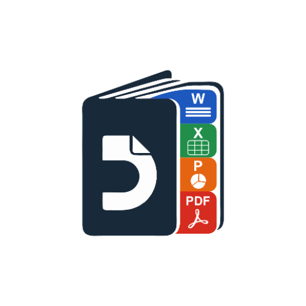

# This Project is under Development

<div align="center">



# DocLite

**Fast, Private, 100% Offline Android Office Suite & Bank Statement Analyzer**

[-brightgreen.svg)](https://developer.android.com)
[-blue.svg)](https://developer.android.com)
[](#privacy--security)
[](LICENSE)
[](https://github.com/HrshD1eux/DocLite/releases/latest/download/app-release.apk)

<p>
  <a href="https://github.com/HrshD1eux/DocLite/releases/latest/download/app-release.apk">
    
  </a>
  <a href="https://hrshd1eux.github.io/DocLite/">
    
  </a>
</p>

</div>

---

## 📌 Overview

**DocLite** is a native, offline-first Android office suite built with Jetpack Compose and modern Android architecture. It allows you to view, edit, and analyze documents and financial statements completely on-device without an internet connection, third-party accounts, cloud sync, or background telemetry.

---

## 📥 Download

* **Direct APK Download**: [Download Latest Release (`app-release.apk`)](https://github.com/HrshD1eux/DocLite/releases/latest/download/app-release.apk)
* **All Releases & Changelog**: [GitHub Releases Page](https://github.com/HrshD1eux/DocLite/releases)
* **Official Website**: [DocLite on GitHub Pages](https://hrshd1eux.github.io/DocLite/)

---

## 🚀 Key Features

### 📄 Document Editors & Viewers
* **Word Documents (`.docx`)**: Create new documents, edit paragraph styling (bold, italic, underline, alignment, font size), localized live word count, and in-editor document rename.
* **Plain Text Editor (`.txt`, `.log`, `.md`)**: Dedicated lightweight text editor featuring monospace rendering, undo/redo history, live word/character counters, and UTF-8 streaming.
* **Spreadsheets (`.xlsx`, `.csv`)**: Open multi-sheet workbooks, inspect cell data, and evaluate formulas instantly via Apache POI.
* **Presentations (`.pptx`)**: Review slides and text frames cleanly on mobile.
* **Google Drive-Style PDF Viewer (`.pdf`)**: Smooth paginated rendering powered by Android's native `PdfRenderer` with bounded LRU memory caching, text search, page jumping, and pinch-to-zoom.

### 🏦 Intelligent Bank Statement Analyzer
Analyze financial statements on your phone with zero data leaving your device:
* **Multi-Format Support**: Reads `.xlsx`, `.csv`, `.txt`, and **password-protected** PDF and Excel statements.
* **Smart Narrative Cleaning**: Automatically cleans cluttered transaction remarks (strips UPI IDs, NEFT/IMPS prefixes, ATM reference numbers) to isolate recognizable payee and payer names.
* **Instant Financial Summary**: Computes total inflows (credits), outflows (debits), net balances, and highlights top 60 transacting entities.
* **Search & Filter**: Search transactions and parties in real time.

### 🔒 Privacy & Architecture
* **100% Offline Execution**: All parsing and rendering happens locally. No documents or sensitive financial logs are transmitted externally.
* **Google Play Compliant**: Adheres to modern Scoped Storage standards (Storage Access Framework `ACTION_OPEN_DOCUMENT` and MediaStore queries) with zero intrusive permissions.
* **R8 Minified & ProGuard Protected**: Hardened release builds with resource shrinking to keep APK footprint minimal.

---

## 🛠️ Technology Stack

* **Language**: Kotlin 2.0+
* **UI**: Jetpack Compose with Material Design 3
* **Concurrency**: Coroutines & StateFlow
* **Database**: Room 2.7.0 (with password-protection metadata, recent and favorite files)
* **Engines**:
  * [Apache POI](https://poi.apache.org/) - Office Open XML document processing
  * [PDFBox-Android](https://github.com/TomRoush/PdfBox-Android) - Password-protected PDF text extraction
  * [OpenCSV](https://opencsv.sourceforge.net/) - High-speed CSV parsing
  * Android Native `PdfRenderer` - Hardware-accelerated PDF rendering

---

## 💻 Building from Source

### Requirements
* **Android Studio** (Ladybug / Koala Feature Drop or newer)
* **JDK 17+**
* **Android SDK 36** (Compile SDK)

### Steps
1. Clone the repository:
   ```bash
   git clone https://github.com/HrshD1eux/DocLite.git
   ```
2. Open the project in Android Studio.
3. Run unit tests to verify:
   ```bash
   ./gradlew testDebugUnitTest
   ```
4. Build the release APK:
   ```bash
   ./gradlew assembleRelease
   ```
   The compiled APK will be located at `app/build/outputs/apk/release/app-release.apk`.

---

## ⚖️ License

This project is licensed under the **GNU General Public License v2.0 (Non-Commercial)**.

### Summary of License Terms:
* **Personal & Educational Use**: You are free to view, study, modify, and run DocLite for personal, educational, and non-commercial open-source purposes.
* **Commercial Use Prohibited**: You may **NOT** use, sell, distribute, or bundle this software, its source code, compiled binaries, or derivatives for any commercial purpose, paid distribution, subscription service, or ad-monetized application without explicit, prior written permission from the copyright holder.
* **Full Terms**: Refer to the [LICENSE](LICENSE) file in this repository for complete legal conditions.
